[](https://github.com/Ramona-Saintandre/UdacityP2-CICD/actions/workflows/pythonapp.yml)


# Udacity Project 2 - Building a CI/CD Pipeline

This project, we were tasked to build a Flask app from this Github repository from scratch.
 This was done by using Continuous Integration and Continuous Delivery.  
I used Github Actions along with a Makefile, requirements.txt and application code to perform an initial lint, test, and install cycle.

Then I  integrated this project into Azure Pipelines in order to enable Continuous Delivery to Azure Web App Service.

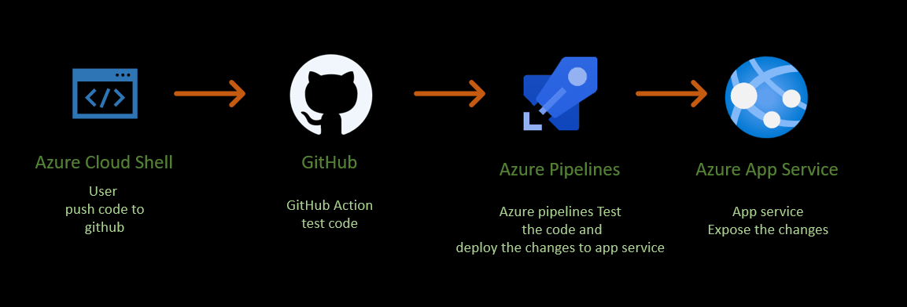
 

## Instructions to recreate this project

#### 1. Prerequisites
To Run this project you will need the following:  

* [Azure account](https://azure.microsoft.com/en-us/). You may also need a free [Microsoft outlook acccount](https://outlook.live.com/owa/)

* [Azure DevOps account](https://dev.azure.com/)

* [GitHub account](https://github.com/)
 
##### 2. Clone the project repository in the Azure cloud shell

You will first, go to your github repository to get the link.  
Click the "Clone" button, select "SSH" and then click the "Copy" button next to the git address.  

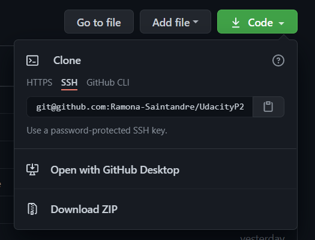

In the Azure Cloud Shell, `cd` to the folder where you want to clone the repository and clone it.

```
cd project name
git clone <paste_your_link>.git
```

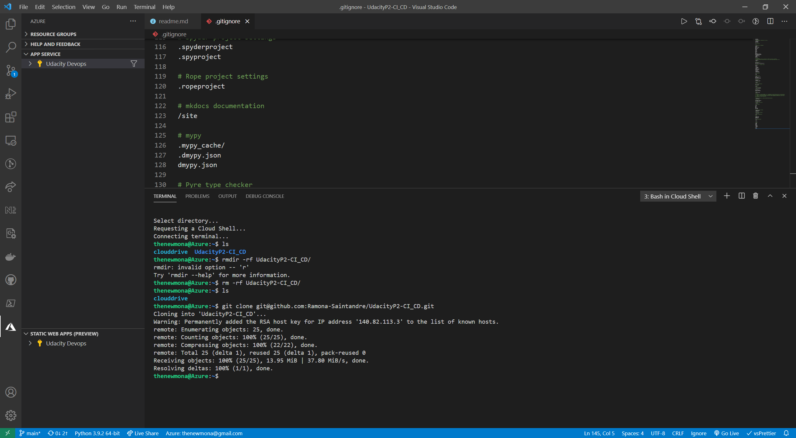  
Only the first time you need to clone the repository. If you need to update it manually you should use the ``` git pull ``` command.


### 3. Setup the project and start the Continous Intergration

**Setup Azure Cloud Shell**
* Login to Azure shell - `az login`  
* Using the Azure Cloud Shell, create an rsa public/private key pair using the command:

 **Create** ssh key for project - <font color=#FF0000>```ssh-keygen -m PEM -t rsa -b 4096```</font>   
     **This command creates a SSH key using RSA encryption and a bit length of 4096**   
   > [!Resource]
>  [Quick steps to create and use and SSH public-private key pair in Azure](https://github.com/MicrosoftDocs/azure-docs/blob/master/articles/virtual-machines/linux/mac-create-ssh-keys.md)
        
In your shell you should see the file where the key is stored. Display the key and copy it.
```
cat <your-keyfile-path>
```
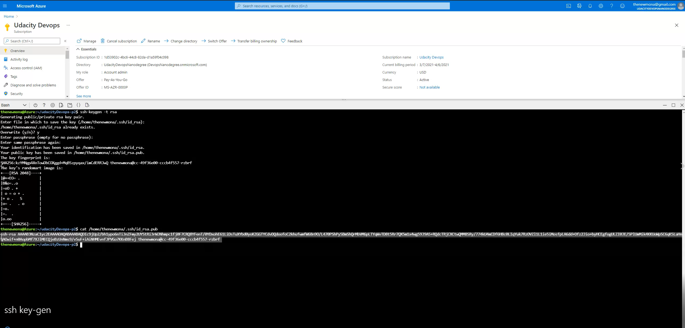
 
> [!NOTE]
> <font color=#FF0000>Now, use [GitHub Settings -> SSH and PGP keys](https://github.com/settings/keys) and click "New SSH key"</font>

Enter a title and paste your sha key in the "Key" field.
Click "Add SSH key" to finish.  
This will allow you to access your GitHub repositories from your Azure Cloud Shell, without being prompting for credentials.

* Now you need to Create a virtual environment: run the `make setup`  
 Or 
 ```bash  
python3 -m venv ~/UdacityP2-CICD/VENV
source ~/UdacityP2-CICD/VENV/bin/activate
```
* Now you will need to run `make all` , this will install the dependencies into the virtual environment.
This command will aso run the test cases that, and show the results of the test. 

#### 3. Configure GitHub Actions (Continous Intergration)

GitHub Actions allow us to automate workflow. In this project we will use an action to test the code. 
> [!NOTE]
> If you just want to run the code, then you can skip creating the Github Actions and just run the App. 
.

To create an Gitub Action from scratch, all you have to do is to:

* Click on "Actions", under your GitHub repository name.
* Click "New Workflow"
  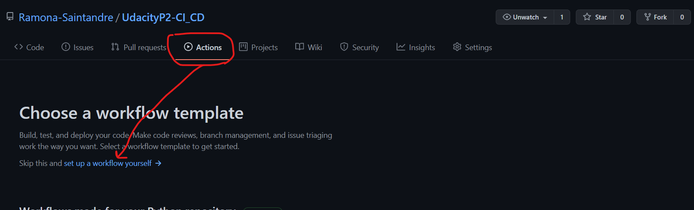
* Click "Setup this workflow" under "Python application"
* Replace the file contents with the contents of the .github/workflows/python-app.yml file
* Click "Start commit"
##### 4 
Create the App Service and initially deply the app in the Azure Cloud Shell. 
This step can be done in the portal. 

`az webapp up --sku S1 -n UdacityP2-CICD`
You can verify that the app is working by navigating to the deployed URL. 
Go to `https://<appname>.azurewebsites.net. 
It should look like this:


##### 5 Run the ML app

Go to your cloned repository and run the commannds.sh file.
Before running the file, replace `UdacityP2-CICD` with your project name in the following files:
* commands.sh
* test_predict_azure_app.sh, if you want to make a prediction using the Azure Cloud Shell.
* test_prediction.py, if you want to make a prediction using the local terminal.
* locustfile.py, if you want to run the locust load test.

```
cd your-git-folder
./commands.sh
```
The application should be up and running. 
Run a test to verify it.
```
./make_predict_azure_app.sh
```
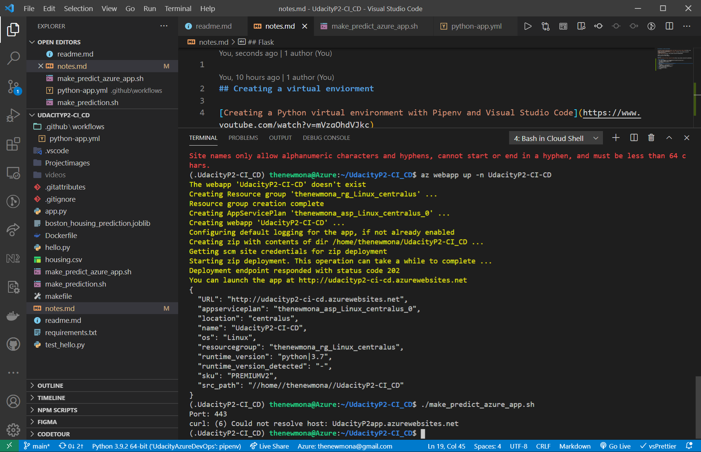 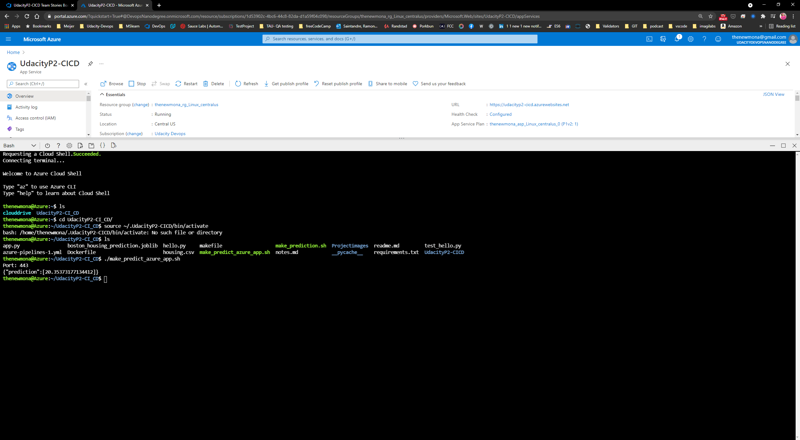

##### 4. Configure Azure pipelines

Azure piplelines automate the deployment process. 
It is required to make a connection between Azure pipelines and GitHub.

* Sign in to [Azure DevOps](https://dev.azure.com/)
* Select "Create project"
* From the new project page, select Project settings from the left navigation
* On the Project Settings page, select Pipelines > Service connections, then select New service connection, and then select Azure Resource Manager from the dropdown
* In the "Add an Azure Resource Manager service connection" dialog box 
    * Enter a connection name
    * Scope level: Subscription
    * Select a resource group 
    * Check "Allow all pipelines to use this connection
* From your project page left navigation, select Pipelines
* Select New pipeline
* Select GitHub
* Select the repository that contains your app
* You may be redirected to GitHub. Click "Approve and Install"
* In the Configure your pipeline screen", select "Python to Linux Web App on Azure"
* On the top left of the screen, select your subscription and on the bottom right click "Continue"
* Select your web app name in the dropdown box, click "Validate and Configure"
* Click "Save and run"
 

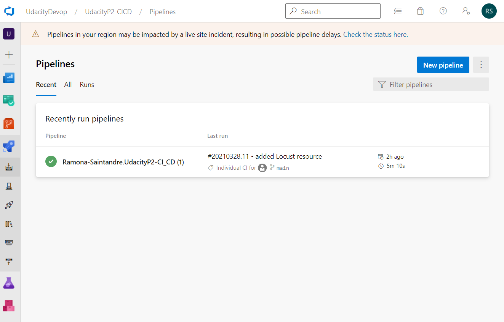

Now the pipeline is ready.  
 Each time you update your repository, the pipeline will automatically pull the new version, it will try to build the application and if the build is successfull it will deploy it.

If you click on a pipeline you will see the commit history and an indicator if it was built and deployed sucessfully.
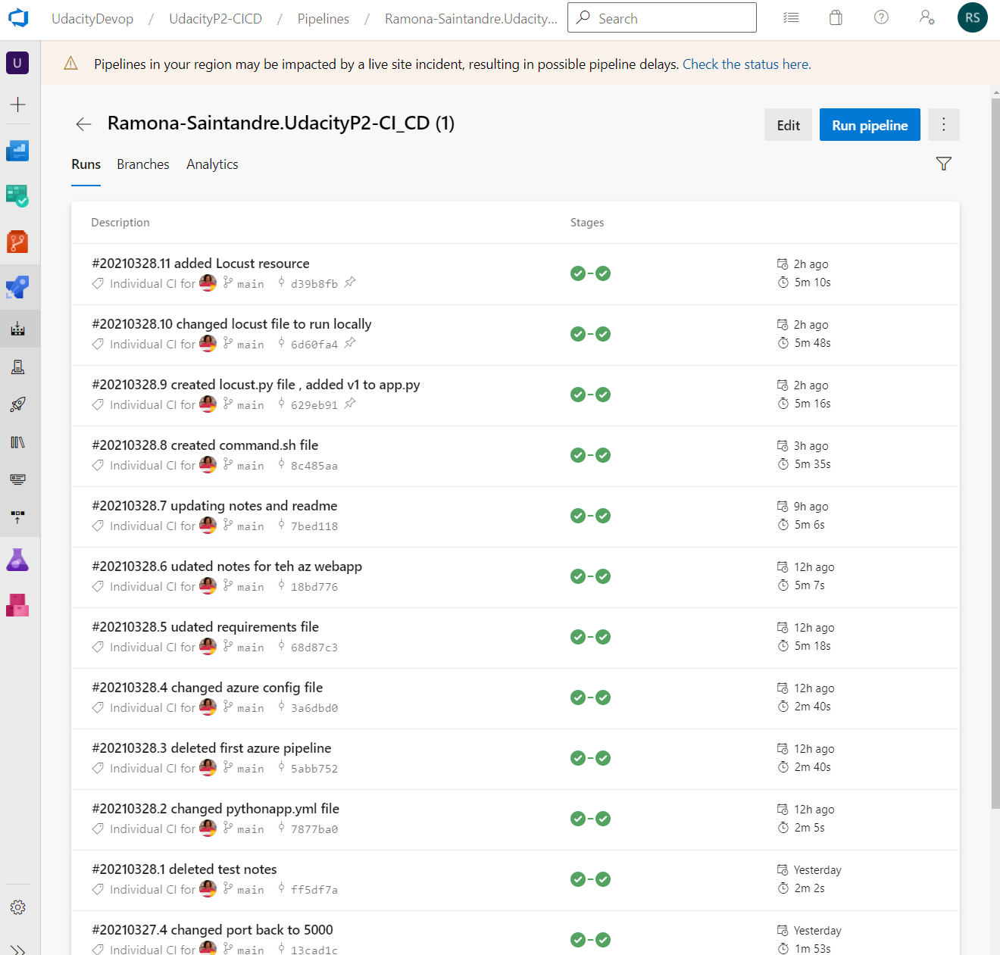

Then you can click on a commit and the build and deploy summary of this commit will be displayed:
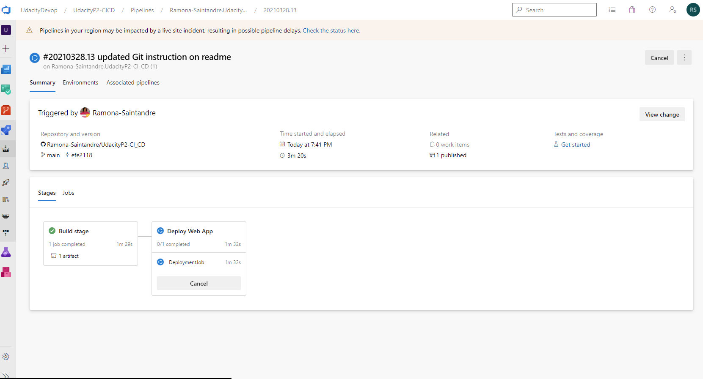

You can also click on the build stage or deploy app to get detailed status.
 This is useful for debugging.  
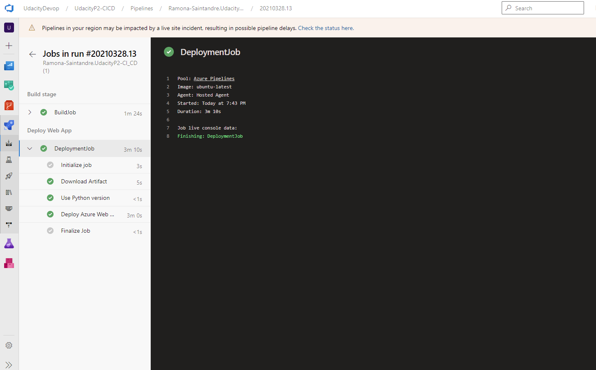


#### Screenshots

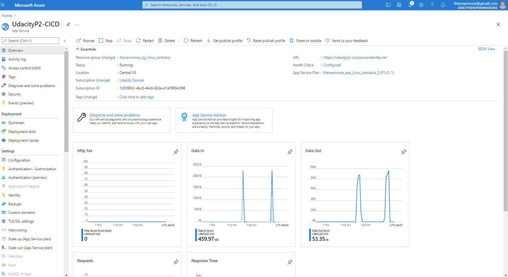


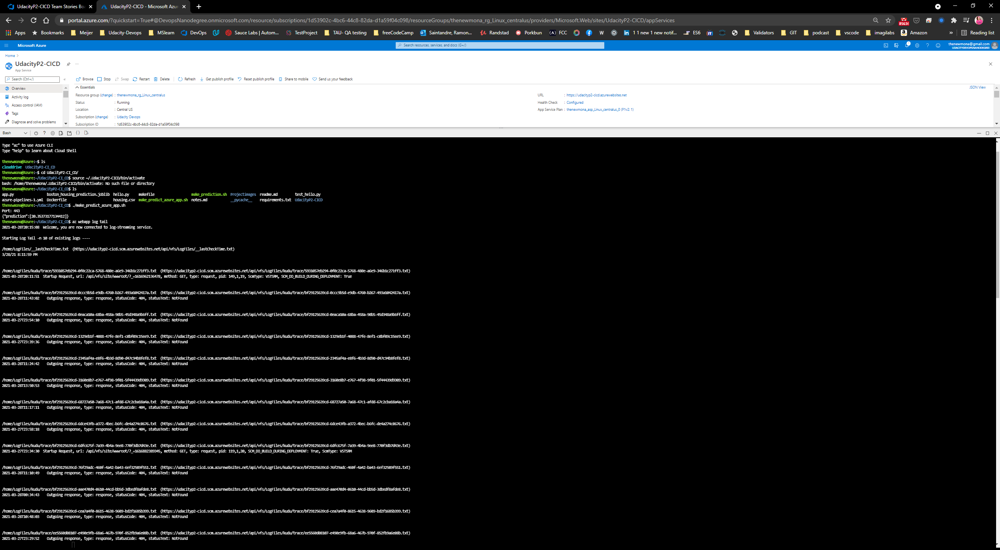

**Locust Test**
***To run the locust test**
1. Pip install locust   
2. verify locust is installed - locust --help   
3. Then write `locust - f <file name> locust.py`  
4. Open the browser to localhost:8089    


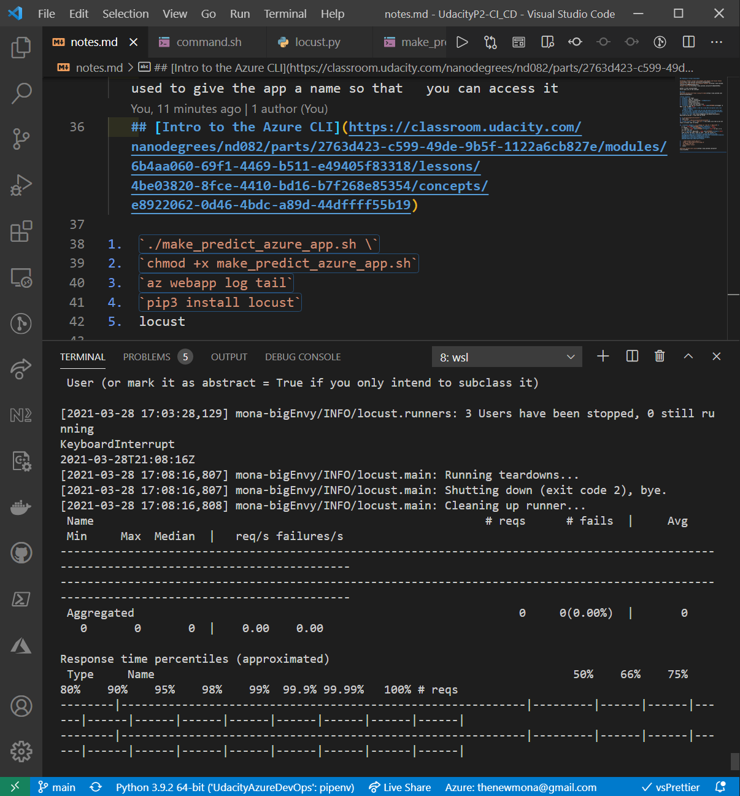

## Enhancements

This is a basic Azure DevOps project that demonstrates a CI/CD pipeline for testing and deploying a Machine Learning application.  

Here are some of the enchancements that I would like to do with this project.

1. To improves the ability of this project to be maintained by a professional software engineering team.   
By creating a Kubernetes version of this project.

2. The second version may also include an architectural diagram.

3. Create another version of the project where you replace the Azure Pipelines Continuous Delivery step with Github Actions. Document the pros and cons of both approaches.
4. Make the GUI output more better.  
   
   
## Project Documentation
**Project Board**  

* [**Trello board for the project**](https://trello.com/b/uyi4JKGr/azure-devops-project-building-a-ci-cd-pipeline)
  
> [!NOTE]
 I also created a Azure board for this project
   

 **Project Plan**
* [**Spreadsheet that includes the original and final project plan**](https://docs.google.com/spreadsheets/d/1W36bsmXI8AUw3Ha9NQisR_4d586ZbRakH-Xi4wrnGhY/edit#gid=1348135932) 

## Demo 
* [![Video walkthrough]
